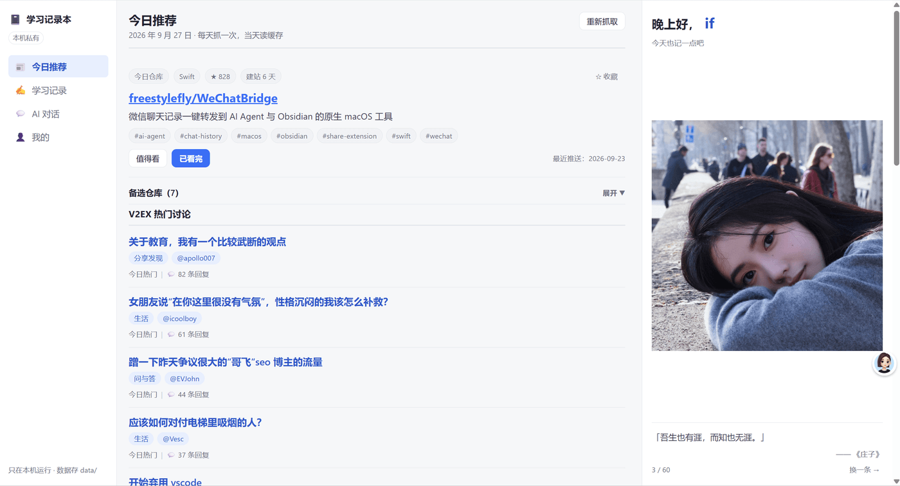
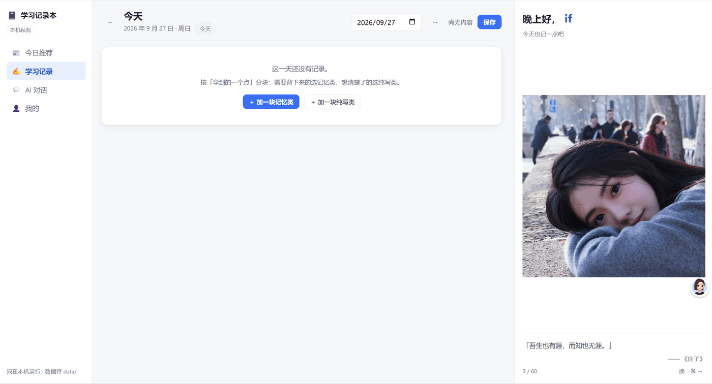
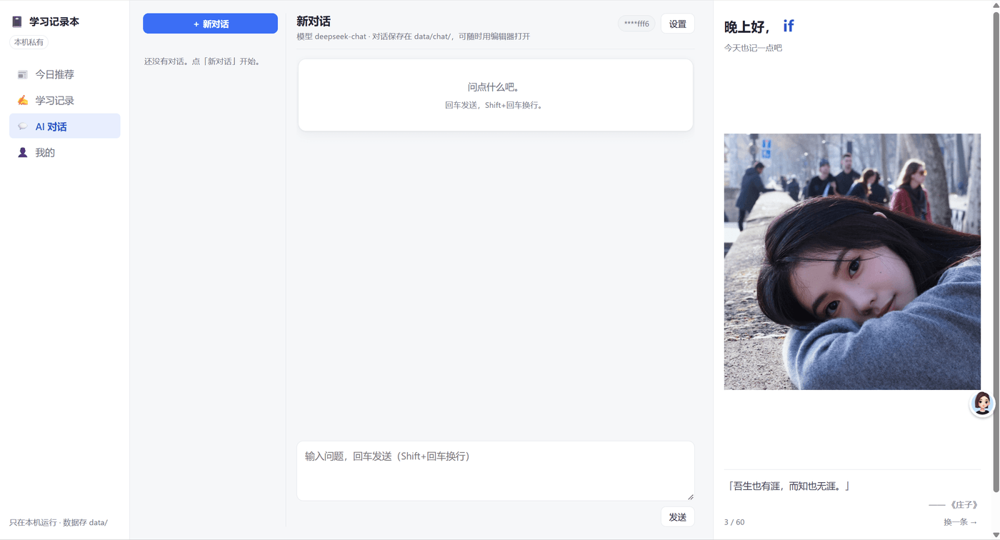
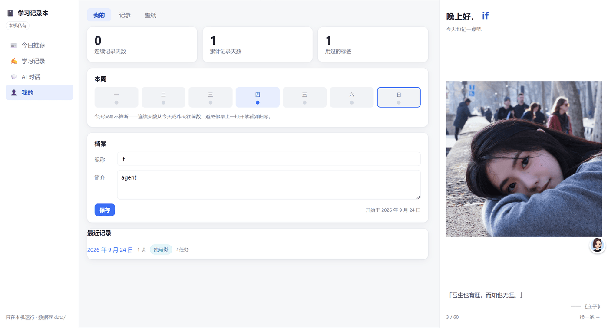
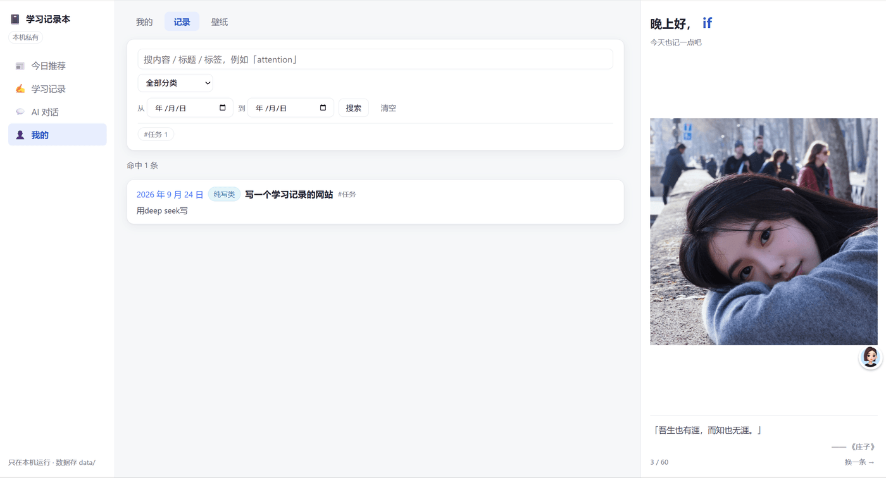
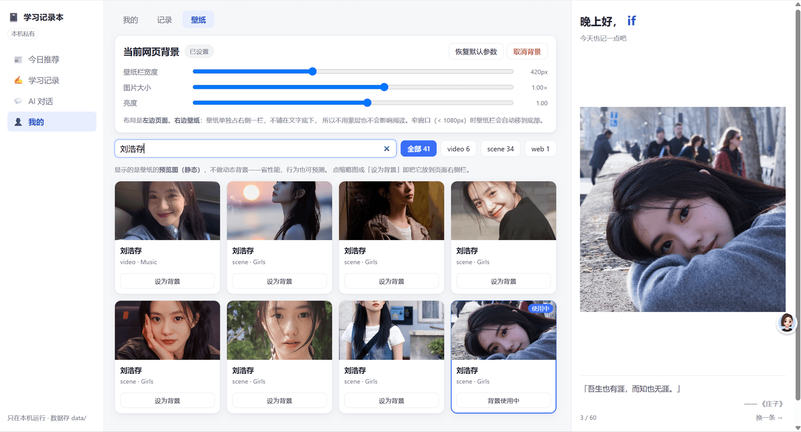

# 学习记录本

一个**只在自己电脑上运行**的私人学习记录工具。笔记、推荐、对话全部存在本地文件里，
不上传、不公开、不需要登录。

## 怎么启动

### 第一步：装 Node.js

需要 [Node.js](https://nodejs.org/) **20.19 或更高版本**（推荐直接装最新的 LTS）。

装完打开终端（Windows 用 PowerShell 或 CMD），确认一下：

```bash
node -v
```

能打印出版本号（比如 `v22.12.0`）就说明装好了。如果提示"不是内部或外部命令"，
说明没装成功或没加进 PATH，重装时注意勾选 Add to PATH。

### 第二步：把代码下载到本地

如果你是在 GitHub 页面上，点绿色的 **Code → Download ZIP**，解压到一个你记得住的
目录（比如 `D:\code`）。

如果你装了 git，也可以用命令行（把地址换成你实际要克隆的仓库地址——
如果你 fork 了自己的副本，或者这个项目已经改名了，就用你自己的）：

```bash
git clone <这个仓库的地址>
cd learning-record-app
```

### 第三步：进入项目文件夹

```bash
cd 你的路径/learning-record-app
```

Windows 举例（路径按你实际解压的位置改）：

```powershell
cd D:\code\learning-record-app
```

> 小技巧：在文件资源管理器里进入这个文件夹，按 `Shift + 右键` 选
> 「在此处打开 PowerShell 窗口」，就直接在正确目录了，省得敲路径。

### 第四步：装依赖（只需做一次）

```bash
npm install
```

会下载依赖，大概几十秒到一两分钟，取决于网速。之后每次启动就不用再跑了。

### 第五步：启动

```bash
npm start
```

看到类似这样的输出就成功了：

```
学习记录本已启动 → http://127.0.0.1:3777
索引：0 天记录 / 0 个标签 · git 自动提交已启用
```

浏览器会**自动打开** `http://127.0.0.1:3777`。如果没自动打开，手动在浏览器里
访问这个地址即可。

> 首次启动会先构建一次前端（约 10 秒），之后启动是秒开。

### 以后每次怎么打开

```bash
cd D:\code\learning-record-app
npm start
```

### 怎么关掉

在运行 `npm start` 的那个终端窗口里按 `Ctrl + C`。

### 可选配置

**名言库**：壁纸栏底部的名言来自 `data/quotes.json`，仓库里没带这个文件，
想要的话复制一份示例：

```bash
# macOS / Linux
mkdir -p data && cp samples/quotes.example.json data/quotes.json

# Windows PowerShell
New-Item -ItemType Directory -Force data; Copy-Item samples\quotes.example.json data\quotes.json
```

**AI 对话**：需要你自己的 DeepSeek API Key（[在这里申请](https://platform.deepseek.com/api_keys)）。
启动后在页面里点「AI 对话 → 设置」填一次，或者启动前设置环境变量：

```bash
# macOS / Linux
export DEEPSEEK_API_KEY=sk-xxxx
npm start

# Windows PowerShell
$env:DEEPSEEK_API_KEY="sk-xxxx"
npm start
```

Key 只保存在你本机（`data/ai.json`），不会提交到 git。

**壁纸栏**（可选）：如果你装了 Wallpaper Engine，会自动读取它订阅的壁纸；
没装的话壁纸面板会提示"没检测到"，不影响其他功能。

## 主要页面

左侧导航有四个入口：今日推荐、学习记录、AI 对话、我的。

### 今日推荐

每天自动挑一个近期活跃的 GitHub 项目，外加 V2EX 热门讨论、掘金最新文章。
可以标记「值得看 / 已看完」，也可以收藏。



### 学习记录

一天一篇笔记，按「学到的点」分块。每块自己选分类（记忆类 / 纯写类）、自己打标签，
块内是想怎么写就怎么写的富文本（支持代码块、表格、链接）。改动会自动保存。



### AI 对话

一个仿 DeepSeek 的聊天页：左边是对话列表，右边边收边显示回复。
对话会存成 Markdown 文件，可以直接用编辑器打开。需要自己的 DeepSeek API Key。



### 我的

看连续记录天数（今天没写不算断，避免早上打开就看到归零）、本周写了哪几天、
个人档案（昵称会显示在右侧壁纸栏的问候里），以及最近记录和收藏的仓库。



「我的」下面还有两个子页：

**记录** —— 检索写过的内容：按关键词全文搜索，也可以按分类、标签、时间范围筛。



**壁纸** —— 读取本机 Wallpaper Engine 已订阅的壁纸（Steam 创意工坊），
把预览图显示在页面右侧独立一栏，可调栏宽、图片大小和亮度。



## 数据存在哪

全部在项目下的 `data/` 目录里，都是普通文件，可以直接用编辑器打开或复制走：

```
data/
├── daily/2026-09-24.md     一天一篇笔记
├── chat/                   AI 对话
├── recommend/              每日推荐快照
├── quotes.json             名言库
├── profile.json            昵称与简介
└── ai.json                 DeepSeek API Key（不会提交到 git）
```

这个目录是你的私人内容，**不跟着代码一起公开**（公开版本由
`scripts/build-public.mjs` 单独构建，那份副本里不含 `data/`）。

## 说明

- **只在本机运行**：服务只绑定 `127.0.0.1`，同网络的其他设备访问不到。
- **不需要任何密钥**：推荐内容来自 GitHub、V2EX、掘金的公开接口。
  只有 AI 对话需要你自己的 DeepSeek Key。
- **数据不出本机**：笔记和对话都只写在你自己的磁盘上。

## 开发

```bash
npm run dev                    # 前端热更新 + 后端
npm run build                  # 构建前端
npm run check                  # 跑全部测试
node scripts/stop-server.mjs   # 停止服务（后台启动时用）
```

### 改代码前值得知道的几个坑

这几个都是实际踩过、排查了很久的，写下来免得重犯：

**1. 文件编码与行尾必须匹配读取方**（Windows 上尤其容易中招）：

| 文件类型 | 必须 | 弄错会怎样 |
| --- | --- | --- |
| `.vbs` | UTF-16LE（带 `FF FE` BOM） | cscript 按 ANSI 读，中文路径解析坏，报"未结束的字符串常量" |
| `.ps1` | UTF-8 with BOM | PowerShell 5.1 按本地代码页读，中文串变乱码 |
| `.cmd` | UTF-8 无 BOM + `chcp 65001` + **CRLF 行尾** | 行尾是 LF 时 cmd 会把语句切错，报 `'tlocal' is not recognized` 这类莫名其妙的错 |
| 源码 / 配置 | UTF-8 | — |

`.cmd` 的编码与行尾可以用 `node scripts/fix-cmd-encoding.mjs` 一键修。
`.gitattributes` 里已声明 `*.cmd text eol=crlf`，否则重新克隆后启动脚本会失效。

**2. 测试绝不能污染真实数据。** 冒烟测试会起一个真实服务并写测试数据，
所以它用 `GIT_DISABLE_COMMIT=1` 关掉那个临时服务端的自动提交，
并在收尾时还原被改动的档案。git 提交/合并的行为改由
`scripts/test-git-commit.mjs` 在**隔离仓库**里验证。

**3. 看界面别只看代码。** 布局、尺寸、遮挡这类问题读 CSS 只能算出"应该是什么样"。
`scripts/shot.mjs` 用本机已装的 Chrome 无头渲染并截图，同时读回真实 DOM 尺寸与
计算样式，还带横向溢出检测——视觉改动用它核对。

**4. AI 的 Key 只在服务端。** 浏览器不保存 Key，请求由本机服务代理转发；
`/api/ai/status` 只回「是否已配置」和 Key 后 4 位，绝不回传 Key 本身（有测试覆盖）。
